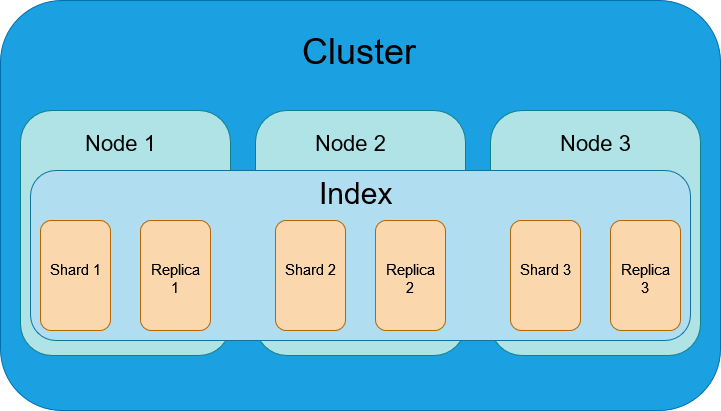

# elk

### J1 - TP1

#### Instalation Elasticsearch et kibana 
Utilisation de docker pour l'instalation d'elasticsearch :
 - `docker pull docker.elastic.co / élasasticsearch / élastique recherche : 8..7.1`
Création d'un nouveau réseaux docker pour elastic et Kibana :
 - `docker network create elastic`
Demarrage d'elastic dans docker :
 - `docker run --name es01 --net elastic -p 9200:9200 -it docker.elastic.co/elasticsearch/elasticsearch:8.7.1`

 #### Probleme lors de la creation 
 ajout d'un variable denvironement qui bloc le deploiement en cas d'absence plus vérification du type d'environment :
  - `-e discovery.type=single-node`
  - la commande est inséré après le `--net elastic` dans la commande de demarrage

#### Connexion
Après telechargement du fichier de certificat de sécurité alors la connexion est refusé : 
 - `curl --cacert http_ca.crt -u elastic https://localhost:9200`

Ajout de l'inactivation de la réponse d'authentification afin d'utiliser la version de dev : 
 - `curl --ssl-revoke-best-effort --cacert http_ca.crt -u elastic https://localhost:9200`

#### Instalation de Kibana
Instalation de Kibana via la commande :
 - `docker pull docker.elastic.co/kibana/kibana:8.7.1`
 - `docker run --name kib-01 --net elastic -p 5601:5601 docker.elastic.co/kibana/kibana:8.7.1`

Le token a expiré et j'ai du le reset via la commande suivante :
- `docker exec -it es-node01 /usr/share/elasticsearch/bin/elasticsearch-create-enrollment-token -s kibana` 

#### Indexation des documenets en lots (bulk)
Pour l'indexation des documents en lots, j'ai utilisé la commande suivante :
- `curl --ssl-revoke-best-effort --cacert http_ca.crt -u elastic -XPOST https://localhost:9200/csv_atp_tennis/_bulk?pretty --data-binary @atp_matches_2018`
ou en langage natif elasticsearch :
- `POST csv_atp_tennis/_bulk?pretty
{ "index": { "_id": "1" }}
{ "field1": "value1" }
{ "delete": { "_id": "2" }}
{ "create": { "_id": "3" }}
{ "field1": "value3" }
{ "update": {"_id" : "1"}}
{ "doc": { "field2": "value2" } }`

#### Question
Elasticsearch procède au mapping, c'est-à-dire à la définition de la structure des données indexées, de deux façons :

  - Mapping dynamique : Elasticsearch analyse automatiquement la structure des documents indexés et tente de déduire le type de données de chaque champ. Il crée ensuite un mapping automatique en fonction de ces déductions. Cela permet d'indexer des données avec une structure flexible et variable, mais peut entraîner des résultats inattendus.

  - Mapping explicite : Vous pouvez définir un mapping personnalisé en créant un mapping explicite avant d'indexer les données. Cela vous permet de spécifier précisément les types de données, les propriétés des champs, les options d'analyse, etc. Vous avez un contrôle total sur la façon dont les données sont indexées et recherchées dans Elasticsearch.

Le mapping dans Elasticsearch est évolutif. Il mettre à jour et modifier le mapping d'un index existant sans perdre les données déjà indexées ; mais certaines modifications de mapping peuvent nécessiter une reindexation des données existantes pour refléter les nouveaux schémas et les nouvelles configurations.

- Exemple de nouveaux mapping : 
```
GET csv_atp_tennis/_mapping
{
  "mappings": {
    "properties": {
      "field1": { "type": "text" }
    }
  }
}
```

Il n'est pas possible de modifier le mapping d'un champ existant dans Elasticsearch sans recréer l'index.
Le mapping d'un index est défini lors de sa création et est ensuite figé. Une fois que l'index est créé avec un certain mapping, vous ne pouvez pas modifier directement le mapping existant d'un champ sans recréer l'index.

La Tokenisation est le processus de conversion d'une chaîne de caractères en une liste de token. Un token est une séquence de caractères dans le texte qui sont regroupés ensemble comme une unité. Par exemple, un token peut être un mot ou un nombre. La tokenisation est utile car elle permet de rechercher des mots individuels plutôt que des chaînes de caractères complètes, ce qui est plus efficace.

La Normalisation est le processus de conversion de mots avec des significations similaires en un seul terme. Par exemple, les mots "marche", "marche", "marche" et "marche" peuvent être normalisés en un seul terme "marche". La normalisation est utile car elle permet de réduire le nombre de termes différents dans l'index, ce qui réduit la taille de l'index et améliore les performances de recherche.

Les API dont nous avons parlé sont les suivant : 
- Index APIs : cette API permet de créer, mettre à jour et supprimer des index. Elle permet également de gérer les alias d'index.
- Document APIs : cette API permet de créer, mettre à jour, supprimer et récupérer des documents individuels.
- Search APIs : cette API permet de rechercher les documents dans un index.

### J1 - TP2

Question A : 
- Création d'un indexeur en NodeJS :

```
const { Client } = require('@elastic/elasticsearch');

// Configuration du client Elasticsearch
const client = new Client({ node: 'http://localhost:9200' });

// Fonction pour indexer un document
async function indexDocument(index, document) {
  try {
    const response = await client.index({
      index: index,
      body: document
    });

    console.log(`Le document a été indexé avec succès : ${response.body.result}`);
  } catch (error) {
    console.error(`Une erreur s'est produite lors de l'indexation du document : ${error}`);
  }
}

// Exemple d'utilisation
const indexName = 'csv_atp_tennis';

const document = {
  "fields" : ["Player_2", "Player_1", "Court", "Winner", "Tournament", "Round", "Series"],
};

indexDocument(indexName, document);

```
 - Création un index avec un mapping spécifique :
```
PUT csv_atp_tennis
{
  "mappings": {
    "properties": {
      "Player_2": { "type": "text" },
      "Player_1": { "type": "text" },
      "Court": { "type": "text" },
      "Winner": { "type": "text" },
      "Tournament": { "type": "text" },
      "Round": { "type": "text" },
      "Series": { "type": "text" }
    }
  }
}
```
 - Indexation des documents en utilisant l'indexeur :
```
const { Client } = require('@elastic/elasticsearch');
const fs = require('fs');

// Configuration du client Elasticsearch
const client = new Client({ node: 'http://localhost:9200' });

// Fonction pour indexer un document
async function indexDocument(index, document) {
  try {
    const response = await client.index({
      index: index,
      body: document
    });

    console.log(`Le document a été indexé avec succès : ${response.body.result}`);
  } catch (error) {
    console.error(`Une erreur s'est produite lors de l'indexation du document : ${error}`);
  }
}

// Exemple d'utilisation
const indexName = 'csv_atp_tennis';

fs.readFile('atp_matches_2018.csv', 'utf8', (err, data) => {
  if (err) {
    console.error(err);
    return;
  }

  const lines = data.split('\n');
  const headers = lines[0].split(',');

  for (let i = 1; i < lines.length; i++) {
    const currentline = lines[i].split(',');

    const document = {};
    for (let j = 0; j < headers.length; j++) {
      document[headers[j]] = currentline[j];
    }

    indexDocument(indexName, document);
  }
});
```
 - Recherche de documents :
```
const { Client } = require('@elastic/elasticsearch');

// Configuration du client Elasticsearch
const client = new Client({ node: 'http://localhost:9200' });

// Fonction pour rechercher des documents
async function searchDocuments(index, query) {
  try {
    const response = await client.search({
      index: index,
      body: {
        query: query
      }
    });

    console.log(`La recherche a retourné ${response.body.hits.total.value} documents :`);
    response.body.hits.hits.forEach(hit => {
      console.log(hit);
    });
  } catch (error) {
    console.error(`Une erreur s'est produite lors de la recherche des documents : ${error}`);
  }
}

// Exemple d'utilisation
const indexName = 'csv_atp_tennis';

const query = {
  match: {
    Player_1: 'Federer'
  }
};

searchDocuments(indexName, query);
```
 - Configurer la recherche : type de query + analyzer :
```
const { Client } = require('@elastic/elasticsearch');

// Configuration du client Elasticsearch
const client = new Client({ node: 'http://localhost:9200' });

// Fonction pour rechercher des documents
async function searchDocuments(index, query) {
  try {
    const response = await client.search({
      index: index,
      body: {
        query: query
      }
    });

    console.log(`La recherche a retourné ${response.body.hits.total.value} documents :`);
    response.body.hits.hits.forEach(hit => {
      console.log(hit);
    });
  } catch (error) {
    console.error(`Une erreur s'est produite lors de la recherche des documents : ${error}`);
  }
}

// Exemple d'utilisation
const indexName = 'csv_atp_tennis';

const query = {
  match: {
    Player_1: {
      query: 'Federer',
      analyzer: 'standard'
    }
  }
};

searchDocuments(indexName, query);
```
 - Utilisation de l’API _analyze pour tester des analyseurs et n’utilisez que des
mappings explicites :
```
const { Client } = require('@elastic/elasticsearch');

// Configuration du client Elasticsearch
const client = new Client({ node: 'http://localhost:9200' });

// Fonction pour analyser un texte
async function analyzeText(index, text) {
  try {
    const response = await client.indices.analyze({
      index: index,
      body: {
        text: text
      }
    });

    console.log(`L'analyse du texte a retourné ${response.body.tokens.length} tokens :`);
    response.body.tokens.forEach(token => {
      console.log(token);
    });
  } catch (error) {
    console.error(`Une erreur s'est produite lors de l'analyse du texte : ${error}`);
  }
}

// Exemple d'utilisation
const indexName = 'csv_atp_tennis';

const text = 'Roger Federer';

analyzeText(indexName, text);
```
 - Utilisation de l’API _analyze pour tester des analyseurs et n’utilisez que des
mappings explicites :
```
const { Client } = require('@elastic/elasticsearch');

// Configuration du client Elasticsearch
const client = new Client({ node: 'http://localhost:9200' });

// Fonction pour analyser un texte

async function analyzeText(index, text) {
  try {
    const response = await client.indices.analyze({
      index: index,
      body: {
        text: text
      }
    });

    console.log(`L'analyse du texte a retourné ${response.body.tokens.length} tokens :`);
    response.body.tokens.forEach(token => {
      console.log(token);
    });
  } catch (error) {
    console.error(`Une erreur s'est produite lors de l'analyse du texte : ${error}`);
  }
}

// Exemple d'utilisation
const indexName = 'csv_atp_tennis';

const text = 'Roger Federer';

analyzeText(indexName, text);
```
Quesiton B :
- Mise en place un système de backup pour votre cluster Elasticsearch :

 - Création d'un snapshot repository :
```
PUT /_snapshot/my_backup
{
  "type": "fs",
  "settings": {
    "location": "/snapshots/my_backup"
  }
}
```
 - Création d'un snapshot :
```
PUT /_snapshot/my_backup/snapshot_1?wait_for_completion=true
```
 - Restauration d'un snapshot :
```
POST /_snapshot/my_backup/snapshot_1/_restore
```
 - Suppression d'un snapshot :
```
DELETE /_snapshot/my_backup/snapshot_1
```
 - Suppression d'un snapshot repository :
```
DELETE /_snapshot/my_backup
```
 - Création d'un snapshot repository :
```
PUT /_snapshot/my_backup
{
  "type": "fs",
  "settings": {
    "location": "/snapshots/my_backup"
  }
}
```
